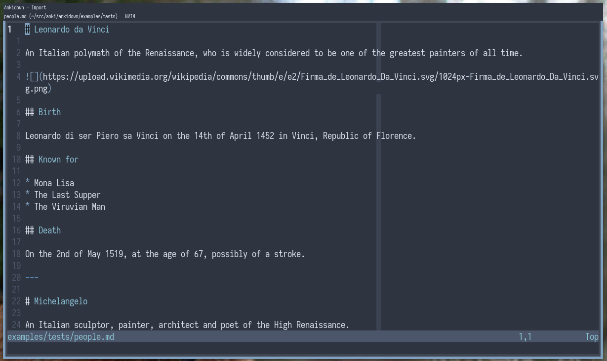

# Ankidown

Ankidown is an in-progress add-on for Anki, the spaced repetition system.
It's primary purpose is to prevent duplicate effort and streamline the creation of Anki cards from your pre-existing non-anki notes.

Currently Ankidown allows you to import a file and it's template, and convert it directly into a pre-existing Note Type (read the Anki manual if this is unfamiliar).

